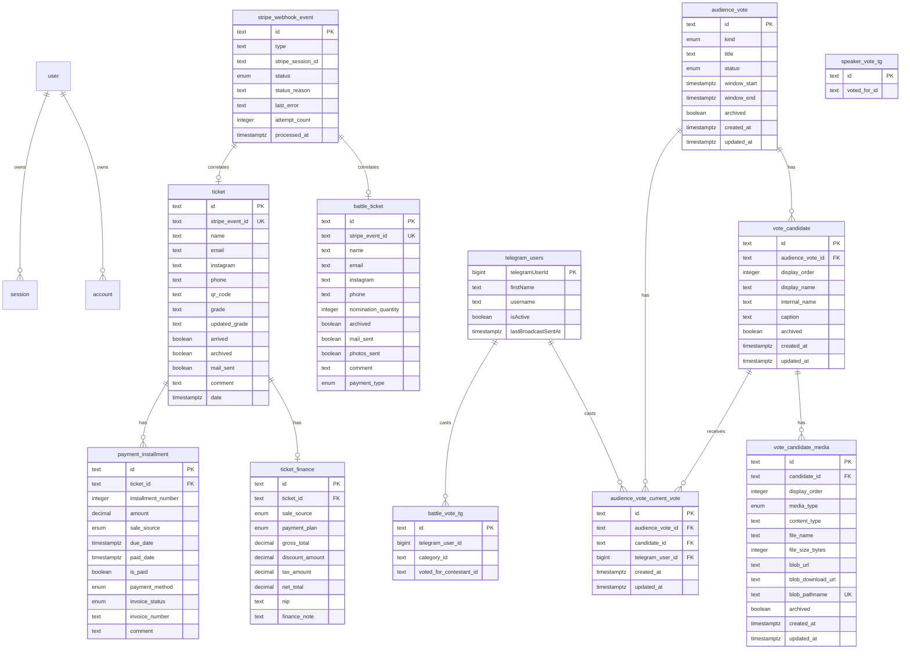

# Data Model

Primary persistence lives in `src/shared/db/schema.ts`; migrations live in
`drizzle/`.

This doc is about relationships and operational meaning. For exact column
definitions, use the Drizzle schema.

## Diagram



The Stripe correlations above are operational correlations, not declared
foreign keys: `stripe_webhook_event.stripe_session_id` matches
`ticket.stripe_event_id` or `battle_ticket.stripe_event_id`.

## Table Groups

### Auth

`user`, `session`, `account`, and `verification` are Better Auth tables.

Ownership:

- Schema: `src/shared/db/schema.ts`
- Auth config: `src/shared/better-auth/auth.ts`
- Client hooks: `src/shared/better-auth/hooks.ts`
- Protected UI layout: `src/app/layouts/protected-layout.tsx`

### Ticket

`ticket` stores regular festival tickets.

Important fields:

- `id`: local public ticket id.
- `stripe_event_id`: for Stripe purchases this stores the Checkout Session id;
  for manual admin records it stores `manual_<ticketId>`.
- `qr_code`: public Vercel Blob URL.
- `grade`: original ticket grade.
- `updated_grade`: optional override shown in some UI/email flows.
- `arrived`: check-in state.
- `mail_sent`: whether the normal ticket email was sent successfully.

Uniqueness:

- `ticket_stripe_event_id_unique` prevents one Stripe checkout from creating
  two regular tickets.

### Battle Ticket

`battle_ticket` stores battle registrations.

Important fields:

- `stripe_event_id`: for Stripe purchases this stores the Checkout Session id;
  for manual admin records it stores `manual_battle_<battleTicketId>`.
- `nomination_quantity`: number of nominations purchased/registered.
- `mail_sent`: battle email status.
- `photos_sent`: operational status for photo delivery.
- `payment_type`: legacy/simple battle payment type.

Uniqueness:

- `battle_ticket_stripe_event_id_unique` prevents one Stripe checkout from
  creating two battle tickets.

### Finance

`ticket_finance` is one-to-one with `ticket`.

Meaning:

- `gross_total`: base ticket amount before discount.
- `discount_amount`: discount amount, not percent.
- `tax_amount`: tax/fee amount. For Stripe webhook-created records this stores
  the app's estimated Stripe fee.
- `net_total`: payable total minus tax/fee.
- `payment_plan`: `full`, `two_parts`, `three_parts`, `custom`, `free`,
  `sponsor`.
- `sale_source`: `site`, `direct_transfer`, or `other`.

Domain calculations live in `src/entities/ticket/model/finance-summary.ts`.

### Payment Installments

`payment_installment` is one-to-many with `ticket`.

Meaning:

- `amount`: installment amount.
- `is_paid`: canonical paid flag used by finance summary.
- `paid_date`: date paid; can be null even when editing unpaid plans.
- `due_date`: due date for unpaid installments.
- `payment_method`: operational payment method.
- `invoice_status` / `invoice_number`: invoice tracking.

Stripe-origin payments:

- Created by `src/app/stripe/handlers/checkout-session-completed.ts`.
- Have `sale_source = site`.
- Are marked `is_paid = true`.
- Are protected from manual edits except invoice fields by
  `src/app/api-routes/payments/[paymentId]/route.ts`.

### Stripe Webhook Event

`stripe_webhook_event` is both an audit table and an idempotency lock.

Primary key:

- `id` is the Stripe event id.

Status values:

- `processing`: a worker claimed the event.
- `processed`: fulfillment completed.
- `ignored`: the app intentionally skipped this event.
- `failed`: fulfillment threw; Stripe can retry and the handler can reclaim.

Why event id, not session id:

- Stripe retries the same event id when delivery fails.
- The session id is stored separately for operator search and correlation with
  ticket/battle rows.

### Telegram Voting

`telegram_users` stores users seen by the bots and broadcast throttling state.

`battle_vote_tg` stores battle/festival vote rows:

- `telegram_user_id`
- `category_id`
- `voted_for_contestant_id`

`speaker_vote_tg` stores speaker vote rows and is aggregated by
`GET /api/speaker_vote`.

### Audience Vote

`audience_vote` stores the core Mini App voting stages for the new Audience
Vote system.

Important fields:

- `kind`: `speaker`, `battle`, or `final_battle`.
- `title`: public title shown to voters later in the Mini App flow.
- `status`: `draft`, `scheduled`, `open`, or `closed`.
- `window_start` / `window_end`: optional planning/display window.
- `archived`: soft-delete flag; normal Operator lists exclude archived rows.

Only one non-archived `audience_vote` row may have `status = 'open'` at a
time. The app validates that rule before opening, and
`audience_vote_one_open_active_idx` enforces it in Postgres.

`vote_candidate` stores Operator-managed options for an Audience Vote.

Important fields:

- `display_order`: Operator-defined order for the voter-facing feed.
- `display_name`: public label shown to voters.
- `internal_name`: Operator-only label or note; Mini App contracts must not
  expose it.
- `caption`: optional public text shown with the candidate.
- `archived`: soft-delete flag; normal Operator lists, voter-facing views, and
  future opening validation exclude archived rows.

`vote_candidate_media` stores public Vercel Blob assets for Vote Candidates.

Important fields:

- `display_order`: upload order for active media.
- `media_type`: `photo` or `video`, derived from the allowed content type.
- `blob_url`: public Vercel Blob URL shown in Operator and future voter views.
- `blob_pathname`: deterministic app-controlled Blob pathname; unique so the
  app never overwrites existing media.
- `archived`: soft-delete flag. Archived/replaced media remains preserved for
  Operators and later cleanup, but normal voter-facing reads should use active
  media only.

Opening and closing are handled by the Audience Vote lifecycle routes. Voter
rows use `audience_vote_current_vote`, which stores the latest selection for
one Telegram Voter in one Audience Vote. It has a unique constraint on
`audience_vote_id` and `telegram_user_id`, so later vote-save flows can update
the current selection instead of preserving vote-change history. Operator
results aggregate this table by `candidate_id` and do not expose a voter list.

`audience_vote_broadcast` stores Operator-confirmed broadcast messages,
canary/normal workflow status, the estimated active recipient count, the
Operator Telegram id used for canaries, and the DB-backed interrupt status.

`audience_vote_broadcast_delivery` stores one durable delivery row per
recipient and stage. Important fields:

- `stage`: `operator_canary`, `voter_canary`, or `normal`.
- `status`: `pending`, `sent`, `failed`, or `skipped`.
- `attempt_count`: incremented when a processor claims the one allowed send
  attempt.
- `next_attempt_at`: due timestamp used by the scheduled processor before a
  delivery has been attempted.
- `sent_at`: records successful Telegram provider handoff.

## Finance Formula

```txt
gross_total - discount_amount = payableTotal
payableTotal - tax_amount     = netTotal
sum(payment.amount where is_paid) = paidTotal
payableTotal - paidTotal      = remainingTotal
```

Zero payment plans:

```txt
payment_plan in ("free", "sponsor")
  -> gross_total = 0.00
  -> discount_amount = 0.00
  -> tax_amount = 0.00
  -> net_total = 0.00
  -> payment_status = paid
```

## Migration Notes

Relevant finance/Stripe migrations:

- `drizzle/0014_stripe_webhook_events.sql`: adds webhook audit/idempotency
  table.
- `drizzle/0015_stripe_fulfillment_uniques.sql`: adds unique constraints on
  `ticket.stripe_event_id` and `battle_ticket.stripe_event_id`.
- `drizzle/0018_payment_sale_source.sql`: adds payment sale source.
- `drizzle/0019_payment_installment_is_paid.sql`: adds `is_paid`.
- `drizzle/0020_finance_discount_storage_backfill.sql`: discount storage
  backfill.
- `drizzle/0022_audience_vote_core.sql`: adds core Audience Vote enums and
  table.
- `drizzle/0023_vote_candidates.sql`: adds Vote Candidates for Audience Votes.
- `drizzle/0024_vote_candidate_media.sql`: adds Vote Candidate Media records
  for public Vercel Blob uploads.
- `drizzle/0025_audience_vote_one_open.sql`: adds the partial unique index that
  allows only one non-deleted open Audience Vote.
- `drizzle/0026_audience_vote_current_votes.sql`: adds the current vote rows
  used for aggregate Operator results and later Mini App vote changes.
- `drizzle/0027_audience_vote_broadcast_canary.sql`: adds Audience Vote
  Broadcast and delivery tables for confirmation and canary staging.
- `drizzle/0028_audience_vote_broadcast_retry_processor.sql`: adds retry
  scheduling metadata and the completed broadcast status.

Production migration work must follow `AGENTS.md`.
